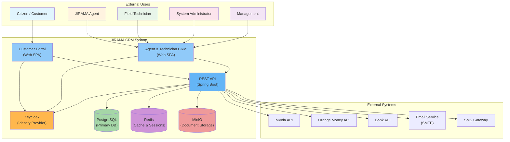

# Component & System Architecture Diagrams

## System Context Diagram (C4 Level 1)



## Container Diagram (C4 Level 2)

```mermaid
graph TB
    subgraph "Frontend Containers"
        Landing["Landing Page<br/>React SPA"]
        CustomerPortal["Customer Portal<br/>React SPA"]
        AgentCRM["Agent CRM<br/>React SPA"]
        TechCRM["Technician CRM<br/>React SPA"]
        AdminPanel["Admin Panel<br/>React SPA"]
        MgmtDashboard["Management Dashboard<br/>React SPA"]
    end
    
    subgraph "Shared Frontend Concerns"
        AuthLib["Keycloak JS<br/>(Auth Adapter)"]
        APIClient["Axios API Client<br/>(JWT Interceptor)"]
        UIComponents["Shadcn UI<br/>Components Library"]
        Charts["Recharts<br/>(Charts & Graphs)"]
        Maps["React Leaflet<br/>(Maps)"]
        Animations["Framer Motion"]
    end
    
    subgraph "Backend Containers"
        Gateway["Nginx<br/>(Reverse Proxy)"]
        
        subgraph "Spring Boot API"
            Controllers["REST Controllers"]
            UseCases["Application Use Cases"]
            Domain["Domain Entities"]
            Repositories["JPA Repositories"]
            Security["Security Layer<br/>(JWT Validation)"]
        end
        
        subgraph "Background Jobs"
            BillGen["Invoice Generator"]
            NotifSender["Notification Sender"]
            ReportGen["Report Generator"]
        end
    end
    
    subgraph "Infrastructure"
        Postgres[("PostgreSQL<br/>16")]
        Redis[("Redis<br/>7")]
        MinIO[("MinIO<br/>Object Storage")]
        Keycloak["Keycloak<br/>(IAM)"]
        Prometheus["Prometheus"]
        Grafana["Grafana"]
    end
    
    Landing --> AuthLib
    CustomerPortal --> AuthLib
    AgentCRM --> AuthLib
    TechCRM --> AuthLib
    AdminPanel --> AuthLib
    MgmtDashboard --> AuthLib
    
    CustomerPortal --> APIClient
    AgentCRM --> APIClient
    TechCRM --> APIClient
    AdminPanel --> APIClient
    MgmtDashboard --> APIClient
    
    CustomerPortal --> UIComponents
    CustomerPortal --> Charts
    CustomerPortal --> Maps
    CustomerPortal --> Animations
    
    Gateway --> Landing
    Gateway --> CustomerPortal
    Gateway --> AgentCRM
    Gateway --> TechCRM
    Gateway --> AdminPanel
    Gateway --> MgmtDashboard
    Gateway --> Controllers
    
    Controllers --> Security
    Controllers --> UseCases
    UseCases --> Domain
    UseCases --> Repositories
    
    Security --> Keycloak
    Repositories --> Postgres
    BillGen --> Postgres
    BillGen --> MinIO
    
    NotifSender --> Redis
    ReportGen --> Postgres
    
    Controllers --> Redis
    Controllers --> MinIO
    
    Prometheus --> Grafana
    Prometheus --> Controllers
    Prometheus --> Postgres
    
    style Landing fill:#bbdefb
    style CustomerPortal fill:#90caf9
    style AgentCRM fill:#90caf9
    style TechCRM fill:#90caf9
    style AdminPanel fill:#90caf9
    style MgmtDashboard fill:#90caf9
```



## Component Diagram — Customer Portal

```mermaid
graph TB
    subgraph "Customer Portal Feature Modules"
        Auth["Authentication"]
        Dashboard["Dashboard"]
        Bills["Bills & Invoices"]
        Payments["Payments"]
        Consumption["Consumption"]
        Incidents["Incidents"]
        Complaints["Complaints"]
        Profile["Profile"]
        Contracts["Contracts"]
        Agencies["Agencies"]
        Notifications["Notifications"]
        Referrals["Referrals"]
        Support["Support / Chat"]
    end
    
    subgraph "Shared Components"
        AppLayout["AppLayout"]
        Sidebar["Sidebar"]
        Topbar["Topbar"]
        DataTable["DataTable"]
        StatusBadge["StatusBadge"]
        AnimatedCounter["AnimatedCounter"]
        MapView["MapView"]
        QrScanner["QrScanner"]
    end
    
    subgraph "State Management"
        ReactQuery["React Query<br/>(Server State)"]
        Zustand["Zustand<br/>(Client State)"]
        AuthCtx["AuthContext<br/>(Keycloak)"]
    end
    
    Dashboard --> AnimatedCounter
    Dashboard --> ReactQuery
    
    Bills --> DataTable
    Bills --> StatusBadge
    Bills --> ReactQuery
    
    Payments --> ReactQuery
    Payments --> DataTable
    
    Consumption --> ReactQuery
    Consumption --> Charts
    
    Incidents --> ReactQuery
    Incidents --> MapView
    
    Complaints --> ReactQuery
    Complaints --> DataTable
    
    Agencies --> MapView
    Agencies --> ReactQuery
    
    Notifications --> ReactQuery
    
    Auth --> AuthCtx
    Dashboard --> AuthCtx
    Bills --> AuthCtx
    Payments --> AuthCtx
    
    AppLayout --> Sidebar
    AppLayout --> Topbar
    AppLayout --> AuthCtx
    
    style Auth fill:#f8bbd0
    style Dashboard fill:#bbdefb
    style Bills fill:#bbdefb
    style Payments fill:#bbdefb
    style Consumption fill:#bbdefb
    style Incidents fill:#bbdefb
    style Complaints fill:#bbdefb
    style Profile fill:#bbdefb
    style Contracts fill:#bbdefb
    style Agencies fill:#bbdefb
    style Notifications fill:#bbdefb
    style Referrals fill:#bbdefb
    style Support fill:#bbdefb
```



## Backend Package Architecture

```mermaid
graph TB
    subgraph "Interface Adapters Layer"
        Controllers["REST Controllers"]
        DTOs["DTOs (Request/Response)"]
        ExceptionHandler["GlobalExceptionHandler"]
        OpenAPI["OpenAPI Config"]
    end
    
    subgraph "Application Layer"
        UseCases["Use Cases<br/>(@UseCase)"]
        PortsIn["Inbound Ports<br/>(Interfaces)"]
        Validators["Custom Validators"]
    end
    
    subgraph "Domain Layer"
        Entities["Domain Entities"]
        ValueObjects["Value Objects"]
        DomainServices["Domain Services"]
        DomainEvents["Domain Events"]
        PortsOut["Outbound Ports<br/>(Repository Interfaces)"]
    end
    
    subgraph "Infrastructure Layer"
        JPAEntities["JPA @Entities"]
        JPARepositories["Spring Data JPA<br/>Repositories"]
        Mappers["Entity ↔ Domain<br/>Mappers"]
        SecurityImpl["Security Implementation"]
        MinIOAdapter["MinIO Adapter"]
        RedisAdapter["Redis Adapter"]
        NotificationAdapter["Notification Senders"]
    end
    
    Controllers --> DTOs
    Controllers --> ExceptionHandler
    Controllers --> UseCases
    Controllers --> PortsIn
    
    UseCases --> Validators
    UseCases --> DomainServices
    UseCases --> PortsOut
    
    DomainServices --> Entities
    DomainServices --> ValueObjects
    DomainServices --> DomainEvents
    
    JPARepositories --> JPAEntities
    JPARepositories --> Mappers
    JPARepositories --> PortsOut
    
    SecurityImpl --> PortsIn
    MinIOAdapter --> PortsOut
    RedisAdapter --> PortsOut
    NotificationAdapter --> PortsOut
    
    style Controllers fill:#81d4fa
    style DTOs fill:#81d4fa
    style ExceptionHandler fill:#81d4fa
    style OpenAPI fill:#81d4fa
    
    style UseCases fill:#a5d6a7
    style PortsIn fill:#a5d6a7
    style Validators fill:#a5d6a7
    
    style Entities fill:#ffcc80
    style ValueObjects fill:#ffcc80
    style DomainServices fill:#ffcc80
    style DomainEvents fill:#ffcc80
    style PortsOut fill:#ffcc80
    
    style JPAEntities fill:#ce93d8
    style JPARepositories fill:#ce93d8
    style Mappers fill:#ce93d8
    style SecurityImpl fill:#ce93d8
    style MinIOAdapter fill:#ce93d8
    style RedisAdapter fill:#ce93d8
    style NotificationAdapter fill:#ce93d8
```



## Deployment Topology

```mermaid
graph TB
    subgraph "Internet"
        Users["End Users"]
        CDN["Cloudflare CDN"]
    end
    
    subgraph "Production Environment (Docker Swarm / K8s)"
        subgraph "Load Balancer"
            Nginx["Nginx<br/>(Reverse Proxy)"]
        end
        
        subgraph "Frontend Nodes"
            FE1["Frontend Replica 1"]
            FE2["Frontend Replica 2"]
        end
        
        subgraph "Backend Nodes"
            BE1["Backend Replica 1"]
            BE2["Backend Replica 2"]
            BE3["Backend Replica 3"]
        end
        
        subgraph "Stateful Services"
            PG_Primary["PostgreSQL<br/>(Primary)"]
            PG_Replica["PostgreSQL<br/>(Read Replica)"]
            Redis_Cluster["Redis Cluster"]
            MinIO["MinIO"]
            Keycloak["Keycloak"]
        end
        
        subgraph "Monitoring"
            Prometheus["Prometheus"]
            Grafana["Grafana"]
            Alertmanager["Alertmanager"]
        end
    end
    
    Users --> CDN
    CDN --> Nginx
    
    Nginx --> FE1
    Nginx --> FE2
    
    Nginx --> BE1
    Nginx --> BE2
    Nginx --> BE3
    
    BE1 --> PG_Primary
    BE2 --> PG_Primary
    BE3 --> PG_Primary
    
    BE1 --> PG_Replica
    BE2 --> PG_Replica
    BE3 --> PG_Replica
    
    BE1 --> Redis_Cluster
    BE2 --> Redis_Cluster
    BE3 --> Redis_Cluster
    
    BE1 --> MinIO
    BE2 --> MinIO
    BE3 --> MinIO
    
    BE1 --> Keycloak
    BE2 --> Keycloak
    BE3 --> Keycloak
    
    BE1 --> Prometheus
    BE2 --> Prometheus
    BE3 --> Prometheus
    
    Prometheus --> Grafana
    Prometheus --> Alertmanager
