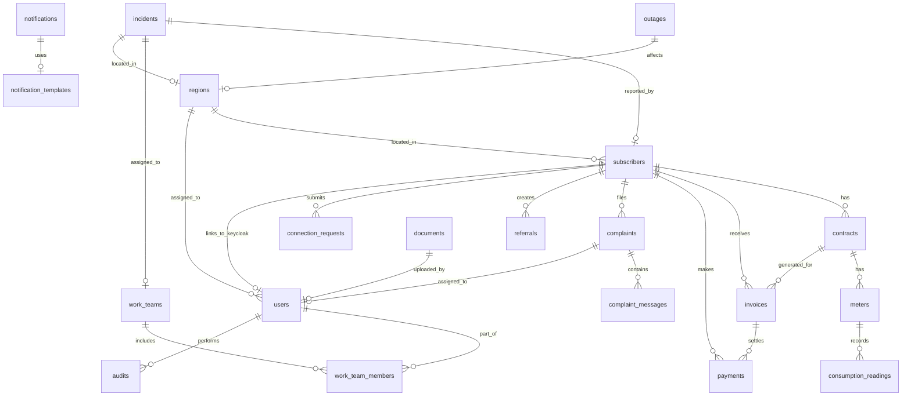

# Entity Relationship Diagram

## ER Diagram (Mermaid)



## Detailed Table Relationships

### Core Customer Domain

```
regions (1) ──< subscribers (N)
  Each subscriber belongs to one geographic region

subscribers (1) ──< contracts (N)
  A subscriber can have multiple contracts (electricity, water, or both)

subscribers (1) ──< invoices (N)
  Each subscriber receives multiple invoices

subscribers (1) ──< payments (N)
  Each subscriber makes multiple payments

subscribers (1) ──< complaints (N)
  A subscriber can file multiple complaints

subscribers (1) ──< incidents (N)
  A subscriber can report multiple incidents

subscribers (1) ──< connection_requests (N)
  A subscriber can have multiple connection requests
```

### Meter & Billing Domain

```
contracts (1) ──< meters (N)
  A contract can have multiple meters (e.g., electricity + water)

meters (1) ──< consumption_readings (N)
  Each meter has a history of readings

contracts (1) ──< invoices (N)
  Each contract generates monthly invoices

invoices (1) ──< payments (N)
  An invoice can be paid in multiple installments
```

### Incident & Work Domain

```
incidents (N) >── (1) work_teams
  An incident is assigned to a work team

work_teams (1) ──< work_team_members (N)
  A team has multiple technician members

users (1) ──< work_team_members (N)
  A user can be part of multiple teams

outages (1) >── (1) regions
  An outage affects a region

outages (N) >── (N) subscribers (via notification)
  Many subscribers can be notified about an outage
```

### Complaint Domain

```
complaints (1) ──< complaint_messages (N)
  Each complaint has a thread of messages

complaints (N) >── (1) users
  A complaint is assigned to an agent/staff member
```

### Notification Domain

```
notification_templates (1) ──< notifications (N)
  Notifications are generated from templates

notifications (N) >── (N) subscribers/users (polymorphic)
  Notifications target either subscribers or staff users
```

### Document Domain (Polymorphic)

```
documents ──> any entity (via entity_type + entity_id)
  Documents can be attached to:
  - subscribers (ID cards, contracts)
  - contracts (signed agreements)
  - invoices (PDFs)
  - complaints (evidence)
  - incidents (photos)
```

### Audit Domain

```
audit_logs ──> any entity (via entity_type + entity_id)
  All important actions are logged with:
  - Who performed the action
  - What entity was affected
  - The old and new values
  - Timestamp
```

## Key Design Decisions

### Why UUID primary keys?
- **Security:** No sequential IDs exposed in URLs
- **Distribution:** Allows offline UUID generation for mobile technicians
- **Sharding:** Easier to shard databases in the future
- **Merging:** No conflicts when merging databases

### Why polymorphic associations (entity_type + entity_id)?
- Documents and audit logs need to reference any entity
- Avoids creating junction tables for every entity combination
- Indexed columns ensure performance
- Application-level enforcement of referential integrity

### Why JSONB for flexible data?
- `regions.geometry`: GeoJSON polygons for mapping
- `incident.affected_areas`: Variable-length list of affected zones
- `notification_templates.variables`: Template-specific variable definitions
- `audit_logs.old_values / new_values`: Flexible storage of entity state diffs
- PostgreSQL JSONB supports indexing (GIN) for querying

### Why partitioned audit_logs?
- Audit tables grow very large (millions of rows)
- Partitioning by month enables:
  - Fast time-range queries
  - Easy archival (detach old partitions)
  - Parallel index creation
  - Efficient `DELETE` of old partitions (DDL, not DML)
