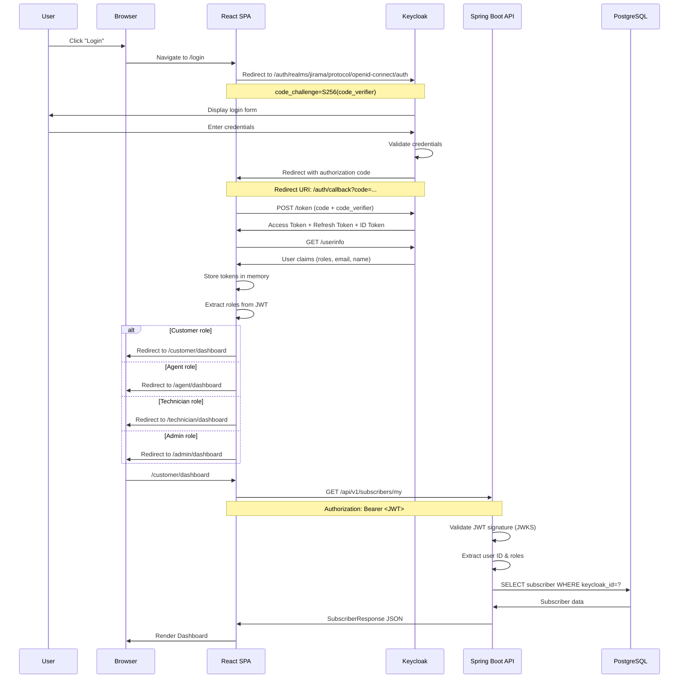
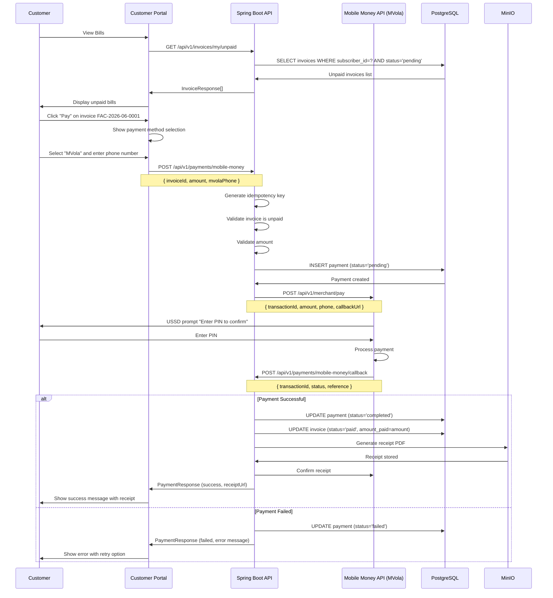
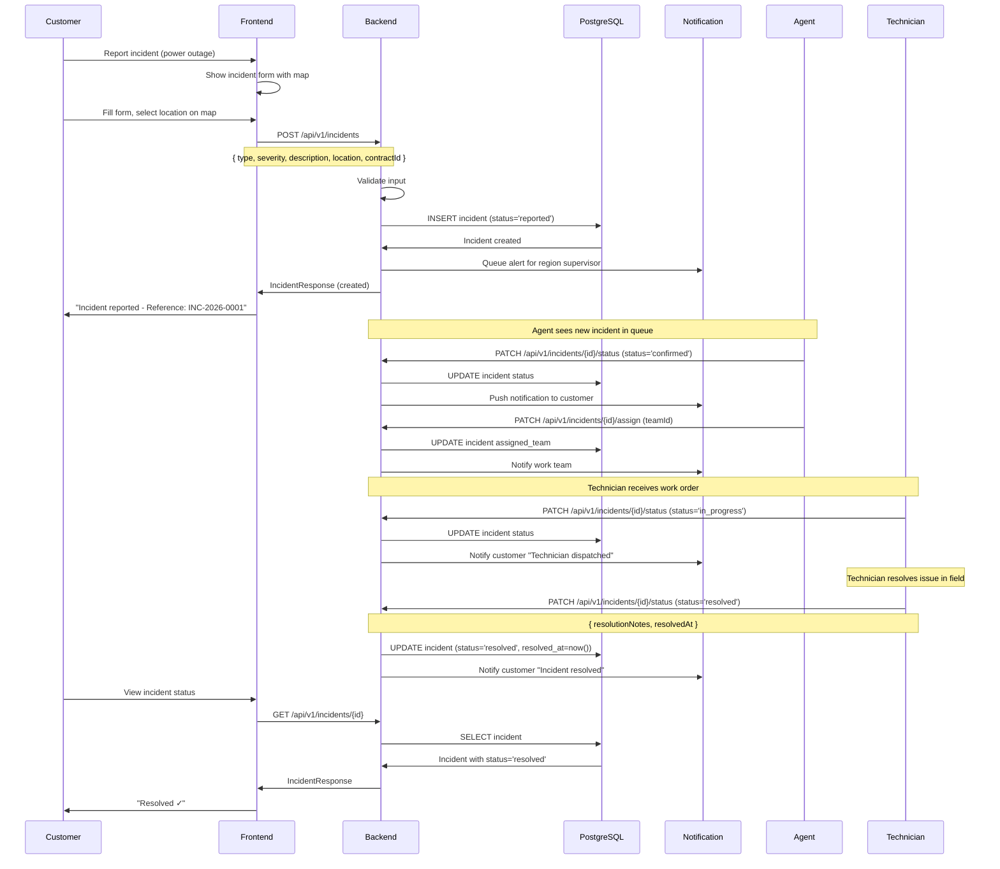
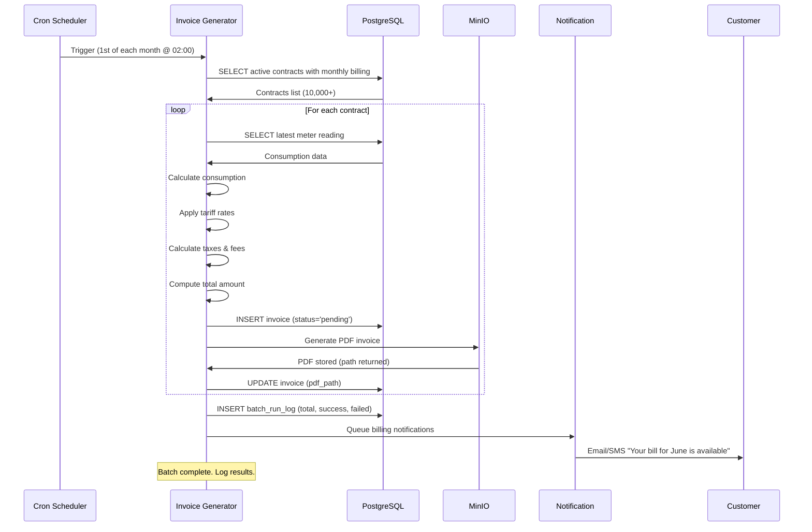
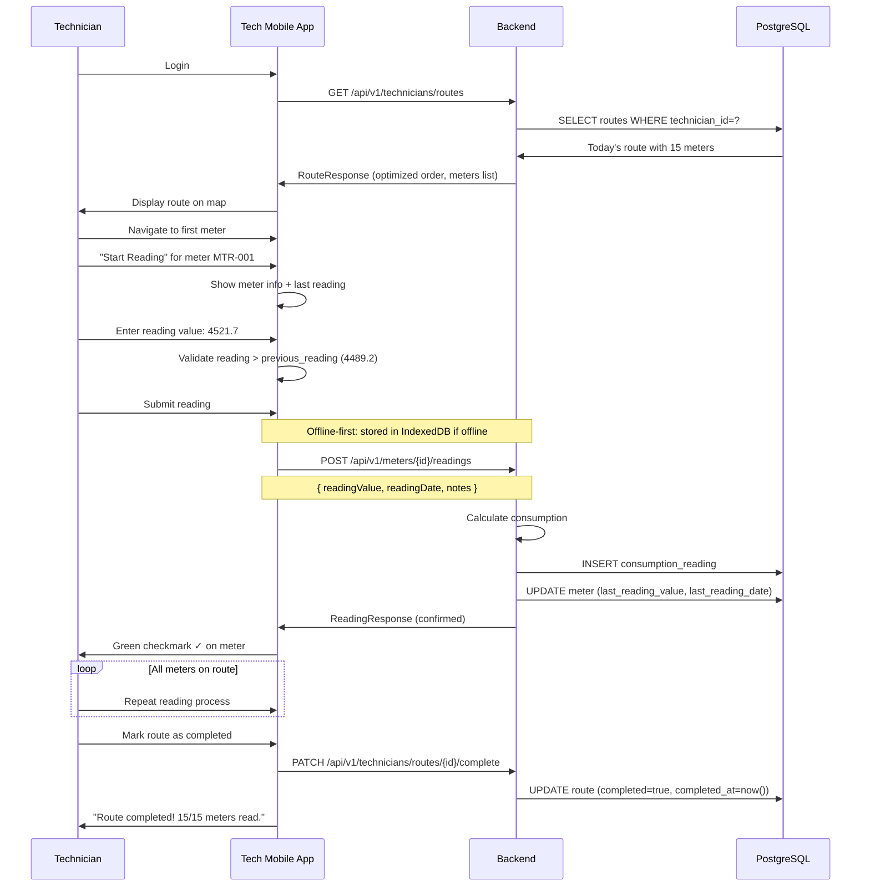

# Sequence Diagrams

## 1. Authentication Flow (OAuth2 + PKCE)

## 2. Bill Payment Flow (Mobile Money)

## 3. Incident Reporting & Resolution Flow

## 4. Invoice Generation (Batch Job)

## 5. Technician Route & Meter Reading Flow

## 6. Key Flow Summary Table

| Flow | Involved Actors | Key Transactions |
|---|---|---|
| **Authentication** | User, Browser, Frontend, Keycloak | Auth code exchange, Token issuance, Role extraction |
| **Bill Payment** | Customer, Frontend, Backend, MobileMoney API | Payment initiation, USSD PIN, Callback, Invoice update |
| **Incident Report** | Customer, Agent, Technician, Backend | Report → Confirm → Assign → Resolve → Notify |
| **Invoice Generation** | Scheduler, BatchJob, DB, MinIO | Batch reading, Tariff calc, PDF gen, Notifications |
| **Meter Reading** | Technician, App, Backend | Route display, Reading entry, DB update |
| **Complaint Tracking** | Customer, Agent, Backend | File → Assign → Message thread → Resolve → Rate |
| **Mass Notification** | Admin, Backend, Email/SMS | Template selection, Recipient filtering, Batch send |
